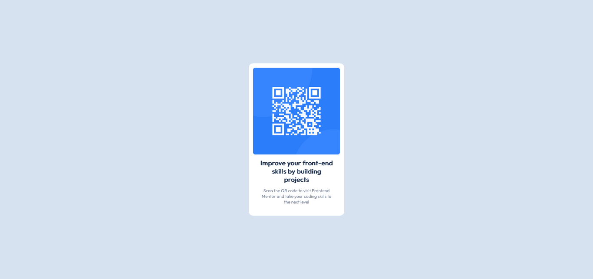

# Frontend Mentor - QR code component solution

This is a solution to the [QR code component challenge on Frontend Mentor](https://www.frontendmentor.io/challenges/qr-code-component-iux_sIO_H).

## Table of contents

- [Overview](#overview)
  - [Screenshot](#screenshot)
  - [Links](#links)
- [My process](#my-process)
  - [Built with](#built-with)
- [Author](#author)

**Note: Delete this note and update the table of contents based on what sections you keep.**

## Overview

### Screenshots

Desktop

### Links

- Solution URL: [https://github.com/OscarCasEsc/FrontendMentor-QR-code-component](https://github.com/OscarCasEsc/FrontendMentor-QR-code-component)
- Live Site URL: [https://oscarcasesc.github.io/FrontendMentor-QR-code-component/](https://oscarcasesc.github.io/FrontendMentor-QR-code-component/)

## My process

### Built with

- Semantic HTML5 markup
- CSS custom properties
- Flexbox

## Author

- Frontend Mentor - [@OscarCasEsc](https://www.frontendmentor.io/profile/OscarCasEsc)
- Twitter - [@oscar023](https://twitter.com/oscar023)
